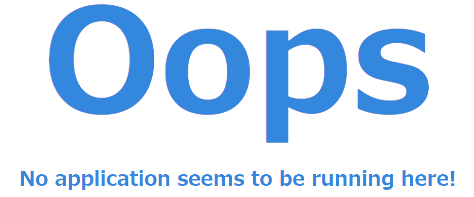
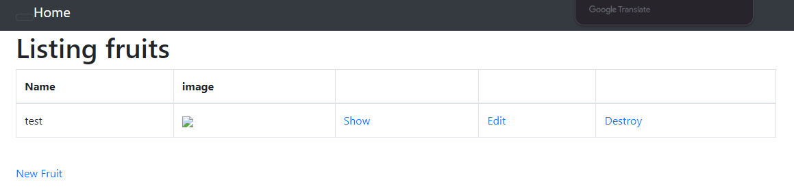
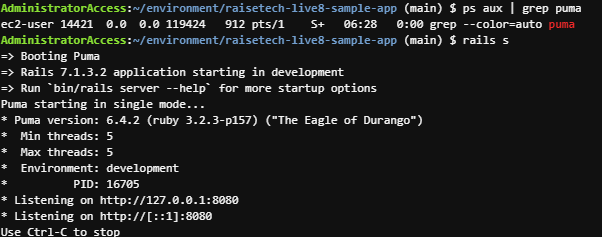
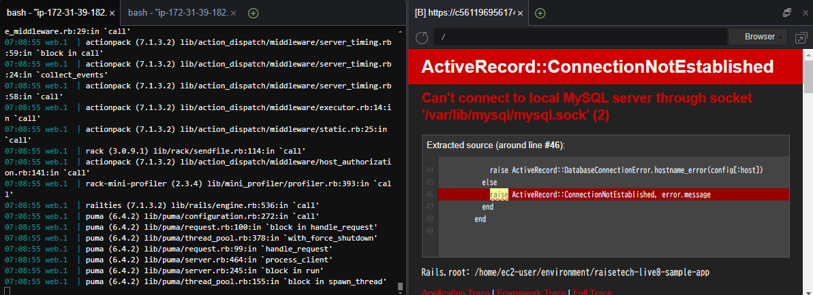

## APサーバーについて調べる
- 名前：Puma
- バージョン：6.4.2

### APサーバー終了時のアクセス確認
アクセスできませんでした

### APサーバー再起動

### APサーバー終了から再起動までのコマンド

## DBサーバーについて調べる
- 名前：MySQL
- バージョン：8.4.2

### DBサーバー終了時のアクセス確認
アクセスできませんでした

## Railsの構成管理ツール
- 名前：Bundler

## 今回の課題で学んだこと、感じたこと

- アプリケーションの実装方法の一連の流れとしてサンプルアプリケーションを実装しました
    - 必要なライブラリのインストール
    - mySQLのインストール
    - BundlerでのRailsのインストール

- 実装の際に、インスタンスタイプの変更・適切なタイプの検討についても学びました
    - t2.micro（無料枠）ではBundlerの実行が止まってしまったため調べました
    - インスタンスタイプの変更をEC2から実施（インスタンスの停止→タイプ変更→起動）
    - Cloud9のコンソール画面からではインスタンスタイプの変更がすぐには反映されないため、ターミナルからコマンドで確認
    - インスタンスメタデータについて
    - t2.smallではまだ止まってしまうため、t3.smallを採用した

- アプリケーションの実装について右も左もわからなかったため、非常に苦戦しました。まさしく何がわからないかわからない状態だったので、録画講義をじっくり見ながら手順を真似する形で実施しています。実務ではお手本がない状態で対応しないといけないので少しでも多くの知識を身に着けておくべきだと痛感しました。今はアプリケーションの実装には怖くなってしまっていますが、いつか難なくこなせるように努力します。