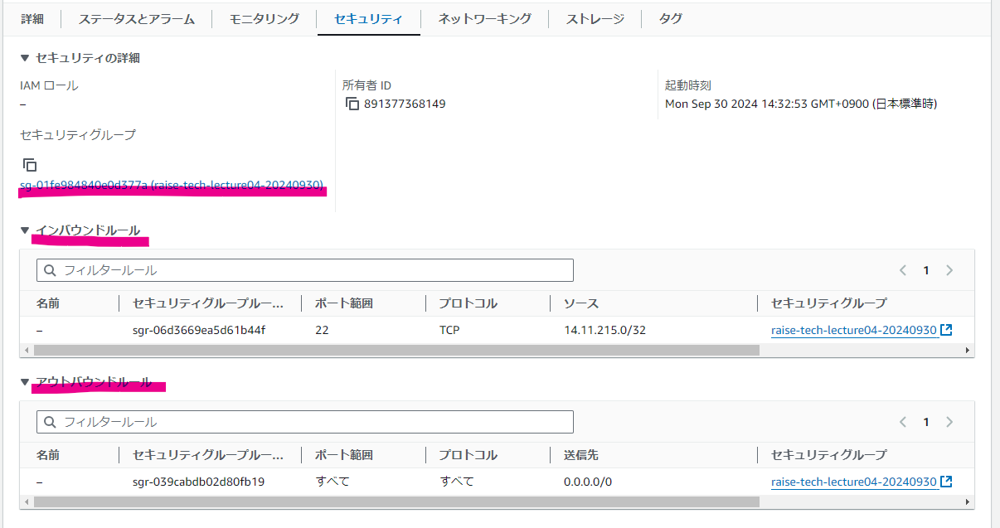
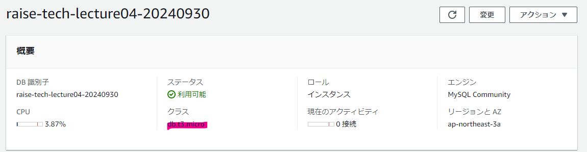

# 第4回課題
- 2024/10/04 修正・追記しました

## VPCの証跡

## EC2の証跡
### EC2のインスタンス概要

### EC2の詳細

### EC2のセキュリティグループ/追加

## RDSの証跡
### RDSの概要/修正
クラスを無料枠の対象に変更しました

### RDSの接続とセキュリティ/修正
サブネットグループからパブリックサブネットを除外しました

### RDSのセキュルティグループ_インバウンド/追加

### RDSのセキュルティグループ_アウトバウンド/追加

## EC2からRDSへの接続
